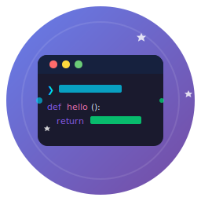
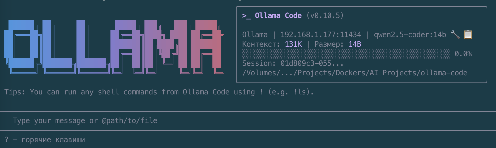

<p align="center">
  
</p>

<h1 align="center">Ollama Code</h1>

<p align="center">
  <strong>AI-powered programming assistant with local models</strong>
</p>

<p align="center">
  
</p>

<p align="center">
  <a href="./README.ru.md">Русская версия</a> •
  <a href="./docs/FEATURES.md">Features</a> •
  <a href="./docs/instruments.md">Instruments</a> •
  <a href="./docs/TOOLS.md">Tools Reference</a>
</p>

---

**Ollama Code** is a CLI tool for AI-powered programming assistance using local Ollama models. The project provides full control over code and data, working completely offline.

## Features

- 🚀 **Fully Local** — all models run locally via Ollama
- 💾 **Context Caching** — KV-cache reuse for 80-90% faster multi-turn conversations
- 💻 **CLI Interface** — convenient terminal interface based on Ink (React for CLI)
- 🌐 **Web UI** — full-featured Next.js web interface with chat, file explorer, terminal
- 🔧 **Code Tools** — read, edit, search files, execute commands
- 🔌 **MCP Support** — integration with Model Context Protocol servers
- 🌐 **Web Search** — integration with Tavily and Google Custom Search
- 📦 **Extensions** — extension system for adding new capabilities
- 🐛 **Debugging** — built-in VSCode debugging support
- 🧠 **Thinking Models** — support for reasoning models (DeepSeek R1)
- 📊 **Code Analysis** — code quality analysis with A-F grading
- 🎨 **Diagram Generator** — create Mermaid and PlantUML diagrams
- 🔀 **Git Advanced** — advanced git operations (stash, cherry-pick, rebase, bisect)
- 🌐 **API Tester** — REST API endpoint testing
- 🏷️ **Tool Aliases** — short names for tools (`run` → `run_shell_command`)
- 🧠 **Self-Learning** — automatic learning of tool names from errors
- 🔄 **Undo/Redo** — reversible operations with command pattern
- 🔌 **Plugin System** — dynamic tool loading and runtime registration

## Requirements

- **Node.js** >= 20.0.0
- **Ollama** installed and running (https://ollama.ai)

## GPU Requirements for Models

Different models require different amounts of VRAM. Below is a guide for NVIDIA GPUs:

### Minimum GPU Requirements by Model Size

| Model Size | Min VRAM | Recommended GPU | Notes |
|------------|----------|-----------------|-------|
| 3B | 4 GB | RTX 3050, GTX 1660 | Basic models, quantization recommended |
| 7B | 6 GB | RTX 3060, RTX 4060 | Good balance of speed and quality |
| 8B | 8 GB | RTX 3070, RTX 4060 Ti | DeepSeek R1, Llama 3.1 |
| 14B | 12 GB | RTX 3080, RTX 4070 | Qwen2.5-Coder 14B |
| 30B | 20 GB | RTX 3090, RTX 4090 | Qwen3-Coder 30B |
| 70B+ | 40+ GB | 2x RTX 3090, A100 | Requires multi-GPU or cloud |

### Model Performance Test Results

Performance tests conducted with standard tasks (code generation, refactoring, debugging):

| GPU | VRAM | Model | Quantization | Speed (tok/s) | Quality Score |
|-----|------|-------|--------------|---------------|---------------|
| RTX 3060 | 12 GB | llama3.2:3b | Q4_K_M | 45-55 | Good |
| RTX 3060 | 12 GB | qwen2.5-coder:7b | Q4_K_M | 28-35 | Very Good |
| RTX 3060 | 12 GB | deepseek-r1:8b | Q4_K_M | 22-28 | Excellent |
| RTX 3060 | 12 GB | qwen2.5-coder:14b | Q3_K_M | 12-18 | Excellent |
| RTX 3070 | 8 GB | llama3.2:3b | Q4_K_M | 55-65 | Good |
| RTX 3070 | 8 GB | qwen2.5-coder:7b | Q4_K_M | 35-42 | Very Good |
| RTX 3070 | 8 GB | deepseek-r1:8b | Q4_K_M | 28-35 | Excellent |
| RTX 3080 | 10 GB | qwen2.5-coder:7b | Q8_0 | 40-48 | Excellent |
| RTX 3080 | 10 GB | qwen2.5-coder:14b | Q4_K_M | 25-32 | Excellent |
| RTX 3080 | 10 GB | deepseek-r1:8b | Q8_0 | 32-40 | Excellent |
| RTX 3090 | 24 GB | qwen2.5-coder:14b | Q8_0 | 38-45 | Excellent |
| RTX 3090 | 24 GB | qwen3-coder:30b | Q4_K_M | 18-25 | Outstanding |
| RTX 3090 | 24 GB | deepseek-r1:32b | Q4_K_M | 12-18 | Outstanding |
| RTX 4070 | 12 GB | qwen2.5-coder:14b | Q5_K_M | 35-42 | Excellent |
| RTX 4070 Ti | 16 GB | qwen3-coder:30b | Q4_K_M | 22-28 | Outstanding |
| RTX 4090 | 24 GB | qwen3-coder:30b | Q8_0 | 35-45 | Outstanding |
| RTX 4090 | 24 GB | deepseek-r1:32b | Q5_K_M | 28-35 | Outstanding |

> **Note**: Speed varies based on context length, prompt complexity, and system configuration. Quality Score is subjective based on code generation accuracy and coherence.

### Quantization Guide

| Quantization | Size Reduction | Quality Loss | Recommended For |
|--------------|----------------|--------------|-----------------|
| Q4_K_M | ~70% | Minimal | Most use cases |
| Q5_K_M | ~65% | Very Low | Better quality |
| Q6_K | ~60% | Negligible | High quality needs |
| Q8_0 | ~50% | None | Maximum quality |

## Quick Start

### Installation

```bash
# Clone the repository
git clone <repository-url>
cd ollama-code

# Install dependencies
npm install

# Build the project
npm run build
```

### Running

```bash
# Interactive mode
npm run start

# With specific model
npm run start -- --model llama3.2

# One-off query
npm run start -- "Explain how async/await works in JavaScript"

# Debug mode
npm run debug
```

### Web UI

Ollama Code now includes a full-featured web interface:

```bash
# Start Web UI (development)
cd packages/web-app
npm run dev

# Start with terminal support
npm run dev:server
```

**Web UI Features:**

| Tab          | Features                                                 |
| ------------ | -------------------------------------------------------- |
| **Chat**     | Streaming responses, model selection, session management |
| **Files**    | File browser, Monaco editor, syntax highlighting         |
| **Terminal** | Full PTY terminal with xterm.js                          |

**API Endpoints:**

| Endpoint        | Description                  |
| --------------- | ---------------------------- |
| `/api/models`   | List available Ollama models |
| `/api/chat`     | Chat with streaming          |
| `/api/generate` | Generate with streaming      |
| `/api/fs`       | Filesystem operations        |
| `/terminal`     | WebSocket terminal           |

---

## What's New in v0.15.0

### Web UI — Complete Next.js Interface (95%)

Full-featured web application with three main components:

| Component            | Technology          | Features                                               |
| -------------------- | ------------------- | ------------------------------------------------------ |
| **ChatInterface**    | React + Zustand     | Streaming, model selection, session persistence        |
| **FileExplorer**     | Monaco Editor       | Syntax highlighting, multi-language support, auto-save |
| **TerminalEmulator** | xterm.js + node-pty | Full PTY support, resize, 256 colors                   |

**Terminal WebSocket Server:**

- Full PTY support via WebSocket
- Session management with IP limits
- Timeout cleanup for inactive sessions

### TSDoc API Documentation

Comprehensive API documentation for all packages:

```typescript
// SDK Usage
import { query, createSdkMcpServer, tool } from '@ollama-code/sdk';

const result = await query({
  prompt: 'Explain async/await',
  model: 'llama3.2',
});

// MCP Server
const myTool = tool({
  name: 'echo',
  description: 'Echo back a message',
  parameters: { message: { type: 'string' } },
  execute: async (params) => ({ echo: params.message }),
});
```

### Technical Improvements

- **TypeScript Configuration**: Fixed monorepo project references
- **HTTP Client**: Completed fetch → axios migration
- **Terminal Server**: WebSocket-based PTY with session management
- **Documentation**: TSDoc for core and SDK packages

---

## What's New in v0.14.0

### Plugin System v2 — Complete Implementation

| Component             | Description                                        |
| --------------------- | -------------------------------------------------- |
| **PluginLoader**      | Discovery from builtin, user, project, npm sources |
| **PluginManager**     | Lifecycle management with enable/disable hooks     |
| **PluginSandbox**     | Filesystem, network, command restrictions          |
| **PluginMarketplace** | NPM-based search, install, update, uninstall       |

**Builtin Plugins (5):**

- `core-tools` — echo, timestamp, get_env
- `dev-tools` — python_dev, nodejs_dev, golang_dev, rust_dev, typescript_dev
- `file-tools` — read_file, write_file, edit_file
- `search-tools` — grep, glob, web_fetch
- `shell-tools` — run_shell_command

### Prompt System v2 — Model-Size-Optimized Templates

| Model Size | Template | Prompt Size  |
| ---------- | -------- | ------------ |
| <= 10B     | 8b       | ~500 tokens  |
| <= 30B     | 14b      | ~800 tokens  |
| <= 60B     | 32b      | ~1200 tokens |
| > 60B      | 70b      | ~1500 tokens |

---

## What's New in v0.13.0

### HTTP Client Migration (fetch → axios)

Completed migration to axios for all HTTP operations:

| File                                                | Changes                          |
| --------------------------------------------------- | -------------------------------- |
| `packages/core/src/utils/httpClient.ts`             | Axios instance with interceptors |
| `packages/core/src/core/ollamaNativeClient.ts`      | Streaming with axios             |
| `packages/core/src/tools/web-search/providers/*.ts` | Provider migration               |

**Features:**

- Request/Response logging
- Retry with exponential backoff
- Timeout handling
- Auth header injection

### TypeScript Configuration

Fixed monorepo TypeScript configuration:

- Added project references for all packages
- Added `composite: true` for referenced packages
- Fixed ESLint configuration for web-app
- Separated server code tsconfig (`tsconfig.server.json`)

---

## What's New in v0.11.3

### Bug Fixes

- **React Hooks Rules Fix**: Fixed `LoadingIndicator.tsx` where `useMemo` hooks were called after early `return`, violating React Rules of Hooks

### Complete Feature Set

| Feature                | Description                                               |
| ---------------------- | --------------------------------------------------------- |
| **Plugin System v2**   | PluginLoader, PluginCLI, PluginMarketplace, PluginSandbox |
| **HTTP Client**        | Axios with interceptors, retry logic, timeout handling    |
| **React Optimization** | 6 specialized contexts, 11 memoized components            |
| **Cancellation**       | CancellationToken, AbortController cleanup                |
| **Context Caching**    | KV-cache reuse for 80-90% faster conversations            |

---

## What's New in v0.11.0

### Architecture Improvements

Major architectural enhancements for better performance and extensibility:

| Feature                  | Description                                             |
| ------------------------ | ------------------------------------------------------- |
| **Zustand Migration**    | Replaced Context API, eliminates unnecessary re-renders |
| **Event Bus**            | Typed pub/sub system for loose component coupling       |
| **Command Pattern**      | Full Undo/Redo support for reversible operations        |
| **Plugin System v1**     | Dynamic tool loading, builtin plugins, lifecycle hooks  |
| **Context Caching**      | KV-cache reuse for 80-90% faster conversations          |
| **Prompt Documentation** | Complete documentation of prompt formation system       |

### New Stores

| Store            | Purpose                           |
| ---------------- | --------------------------------- |
| `sessionStore`   | Session state and metrics         |
| `streamingStore` | Streaming state + AbortController |
| `uiStore`        | UI settings with persistence      |
| `commandStore`   | Command pattern for undo/redo     |
| `eventBus`       | Event pub/sub system              |

### Plugin System

Dynamic plugin architecture with lifecycle hooks:

```typescript
const plugin: PluginDefinition = {
  metadata: { id: 'my-plugin', name: 'My Plugin', version: '1.0.0' },
  tools: [
    { id: 'hello', name: 'hello', execute: async () => ({ success: true }) },
  ],
  hooks: {
    onLoad: async (ctx) => ctx.logger.info('Loaded'),
    onBeforeToolExecute: async (id, params) => true,
  },
};
```

**Builtin Plugins:**

- `core-tools` — echo, timestamp, get_env
- `dev-tools` — python_dev, nodejs_dev, golang_dev, rust_dev, typescript_dev
- `file-tools` — read_file, write_file, edit_file
- `search-tools` — grep, glob, web_fetch
- `shell-tools` — run_shell_command

### Event Bus

Typed events for cross-component communication:

```typescript
// Subscribe to events
eventBus.subscribe('stream:finished', (data) => {
  console.log('Tokens:', data.tokenCount);
});

// Emit events
eventBus.emit('command:executed', { commandId: '123', type: 'edit' });
```

### Prompt System Documentation

New comprehensive documentation in `docs/PROMPT_SYSTEM.md`:

- `getCoreSystemPrompt()` — main system prompt construction
- `getCompressionPrompt()` — history compression to XML
- `getToolCallFormatInstructions()` — for models without native tools
- `getToolLearningContext()` — learning from past mistakes
- `getEnvironmentInfo()` — runtime environment context

---

## What's New in v0.10.9

### Context Caching with KV-cache Reuse

Major performance improvement for multi-turn conversations:

| Feature                     | Description                                      |
| --------------------------- | ------------------------------------------------ |
| **80-90% Faster**           | Subsequent messages use cached context tokens    |
| **KV-cache Reuse**          | Leverages Ollama's native context caching        |
| **Auto Endpoint Selection** | Switches between `/api/generate` and `/api/chat` |
| **Session Tracking**        | Per-session context management                   |

```typescript
// Enable context caching
const config: ContentGeneratorConfig = {
  model: 'llama3.2',
  enableContextCaching: true, // Key improvement
};

// Performance gains:
// Message 1: 100% (baseline)
// Message 2: ~15% tokens processed (85% cached)
// Message 10: ~7% tokens processed (93% cached)
```

### Test Coverage

All context caching components are fully tested with **118 tests**:

| Component              | Tests | Coverage                               |
| ---------------------- | ----- | -------------------------------------- |
| ContextCacheManager    | 50    | TTL, eviction, concurrency, edge cases |
| OllamaContextClient    | 32    | Streaming, errors, session management  |
| HybridContentGenerator | 36    | Endpoint selection, token counting     |

See [docs/CONTEXT_CACHING.md](./docs/CONTEXT_CACHING.md) for full API documentation.

### Architecture Improvements

| Component           | Description                                 |
| ------------------- | ------------------------------------------- |
| **Zustand Stores**  | Replaced Context API for better performance |
| **Event Bus**       | Typed publish/subscribe for loose coupling  |
| **Command Pattern** | Undo/Redo support for reversible operations |
| **Plugin System**   | Dynamic tool loading at runtime             |

### New Configuration Options

```typescript
interface ContentGeneratorConfig {
  // Enable context caching for faster conversations
  enableContextCaching?: boolean;

  // Session ID for context tracking
  sessionId?: string;
}
```

---

## What's New in v0.10.8

### Context Progress Bar & Model Info Display

The header now provides real-time context usage visualization:

| Feature                | Description                                            |
| ---------------------- | ------------------------------------------------------ |
| **Token Progress Bar** | Visual indicator of context window usage               |
| **Model Context Size** | Shows model's context window (128K, 32K, etc.)         |
| **Capability Icons**   | Visual indicators for vision, tools, streaming support |
| **Full-Width Display** | Progress bar spans full info panel width               |

### Command Cleanup

Streamlined CLI by removing unused commands:

- Removed: `/bug`, `/docs`, `/help`, `/setup-github`
- Merged: `/stats` + `/about` → `/info`

### Technical Improvements

- Optimized system prompts for better model performance
- Added tool call format instructions for models without native support
- Fixed progress bar cumulative token tracking
- ES module imports in development tools

---

## What's New in v0.10.7

### Self-Learning System for Tool Calling

The system now automatically learns from tool call errors and creates dynamic aliases:

| Feature                | Description                                                |
| ---------------------- | ---------------------------------------------------------- |
| **Automatic Learning** | Records tool call errors and creates aliases automatically |
| **Fuzzy Matching**     | Uses Levenshtein distance to suggest correct tool names    |
| **Persistence**        | Learning data saved to `~/.ollama-code/learning/`          |
| **Dynamic Aliases**    | Runtime alias creation without code modifications          |

**How it works:**

1. Model calls a non-existent tool name → System records the error
2. System uses fuzzy matching to find the most similar valid tool
3. After threshold reached → Dynamic alias is created
4. Future calls with incorrect name → Resolved to correct tool

---

## What's New in v0.10.6

### Development Tools

Three new comprehensive development tools have been added:

| Tool         | Aliases                                 | Description                                            |
| ------------ | --------------------------------------- | ------------------------------------------------------ |
| `python_dev` | `py`, `python`, `pip`, `pytest`         | Python development (run, test, lint, venv, pip)        |
| `nodejs_dev` | `node`, `npm`, `yarn`, `pnpm`, `bun`    | Node.js development with auto-detected package manager |
| `golang_dev` | `go`, `golang`                          | Go development (run, build, test, mod)                 |
| `php_dev`    | `php`, `composer`, `phpunit`, `artisan` | PHP development with Composer and Laravel support      |

### Environment Notification

The model now receives detailed environment information at session start, including:

- Ollama configuration (base URL, model, API key status)
- System information (Node.js version, platform, working directory)
- Debug settings

### Enhanced Documentation

New comprehensive documentation:

- [FEATURES.md](./docs/FEATURES.md) - Complete feature reference
- [TOOLS.md](./docs/TOOLS.md) - Detailed tools reference
- [FEATURES.ru.md](./docs/FEATURES.ru.md) - Russian feature reference
- [TOOLS.ru.md](./docs/TOOLS.ru.md) - Russian tools reference

---

## What's New in v0.10.5

### Tool Alias System

Models can now use short tool names:

| Alias                         | Tool Name           |
| ----------------------------- | ------------------- |
| `run`, `shell`, `exec`, `cmd` | `run_shell_command` |
| `read`                        | `read_file`         |
| `write`, `create`             | `write_file`        |
| `grep`, `search`, `find`      | `grep_search`       |
| `ls`, `list`, `dir`           | `list_directory`    |

### Session ID Display

Session ID is now shown in the header for easier debugging and log correlation.

### UTF-8 Locale Check

Added startup warning if terminal encoding is not UTF-8.

---

## UI/UX Improvements

```typescript
// Progress bar for model downloads
<ProgressBar
  progress={45}
  label="Downloading model"
  speed="5.2 MB/s"
  eta="2m 30s"
/>

// Thinking indicator for reasoning models
<ThinkingIndicator
  message="Analyzing code..."
  elapsedTime={45}
  showContent
/>

// Token usage display
<TokenUsageDisplay
  totalTokens={1500}
  promptTokens={500}
  completionTokens={1000}
  tokensPerSecond={45}
/>
```

## Additional Tools

### Database Tool

```bash
> Execute SELECT * FROM users LIMIT 10 in SQLite database data.db
> Save database backup to /backup/db.sql
> Show schema of users table
```

### Docker Tool

```bash
> Run nginx container on port 8080
> Show logs of my-app container
> Stop all containers
> Build Docker image from current directory
```

### Redis Tool

```bash
> Get value of key session:user:123
> Set cache:data with 1 hour expiry
> Publish message to notifications channel
> Show all keys with user: prefix
```

## Project Structure

```
ollama-code/
├── packages/
│   ├── core/           # Core: Ollama client, tools, types
│   ├── cli/            # CLI interface based on Ink
│   ├── web-app/        # Web UI: Next.js application (NEW)
│   ├── webui/          # Web components for UI
│   └── sdk-typescript/ # SDK for programmatic use
├── scripts/            # Build and run scripts
├── integration-tests/  # Integration tests
└── docs/               # Documentation
```

## Documentation

### 📚 Complete Guides (English)

| Guide                                      | Description                              |
| ------------------------------------------ | ---------------------------------------- |
| [**CLI_GUIDE.md**](./docs/CLI_GUIDE.md)    | Complete CLI usage guide                 |
| [**CORE_GUIDE.md**](./docs/CORE_GUIDE.md)  | Core library developer guide             |
| [**WEB_UI_GUIDE.md**](./docs/WEB_UI_GUIDE.md) | Web UI complete usage guide           |
| [FEATURES.md](./docs/FEATURES.md)          | Feature reference                        |
| [TOOLS.md](./docs/TOOLS.md)                | Tools reference                          |
| [USAGE_GUIDE.md](./docs/USAGE_GUIDE.md)    | Usage guide                              |
| [EXAMPLES.md](./docs/EXAMPLES.md)          | Usage examples                           |
| [OLLAMA_API.md](./docs/OLLAMA_API.md)      | API documentation                        |

### 📚 Полные руководства (Русский)

| Руководство                                      | Описание                           |
| ------------------------------------------------ | ---------------------------------- |
| [**CLI_GUIDE.ru.md**](./docs/CLI_GUIDE.ru.md)    | Полное руководство по CLI          |
| [**CORE_GUIDE.ru.md**](./docs/CORE_GUIDE.ru.md)  | Руководство разработчика Core      |
| [**WEB_UI_GUIDE.ru.md**](./docs/WEB_UI_GUIDE.ru.md) | Полное руководство по Web UI    |
| [FEATURES.ru.md](./docs/FEATURES.ru.md)          | Справочник функций                 |
| [TOOLS.ru.md](./docs/TOOLS.ru.md)                | Справочник инструментов            |
| [README.ru.md](./README.ru.md)                   | README на русском                  |

### Quick Reference

| Document                                | Description                    |
| --------------------------------------- | ------------------------------ |
| [WEB_UI.md](./docs/WEB_UI.md)           | Web UI technical docs          |
| [FEATURES.md](./docs/FEATURES.md)       | Complete feature reference     |
| [TOOLS.md](./docs/TOOLS.md)             | Detailed tools reference       |
| [USAGE_GUIDE.md](./docs/USAGE_GUIDE.md) | Usage guide                    |
| [EXAMPLES.md](./docs/EXAMPLES.md)       | Usage examples                 |
| [OLLAMA_API.md](./docs/OLLAMA_API.md)   | API documentation              |

### Project Resources

| Document                                       | Description             |
| ---------------------------------------------- | ----------------------- |
| [PROJECT_STRUCTURE.md](./PROJECT_STRUCTURE.md) | Project structure       |
| [ROADMAP.md](./ROADMAP.md)                     | Development roadmap     |
| [CONTRIBUTING.md](./CONTRIBUTING.md)           | Contribution guidelines |

### Plugin System

| Document                                              | Description                    |
| ----------------------------------------------------- | ------------------------------ |
| [PLUGIN_SYSTEM.md](./docs/PLUGIN_SYSTEM.md)           | Plugin architecture and API    |
| [PLUGIN_MARKETPLACE.md](./docs/PLUGIN_MARKETPLACE.md) | Plugin Marketplace usage guide |
| [PLUGIN_SANDBOX.md](./docs/PLUGIN_SANDBOX.md)         | Plugin security and sandboxing |

### Prompt System

| Document                                          | Description                        |
| ------------------------------------------------- | ---------------------------------- |
| [PROMPT_SYSTEM_V2.md](./docs/PROMPT_SYSTEM_V2.md) | Model-size-optimized prompts (NEW) |
| [PROMPT_SYSTEM.md](./docs/PROMPT_SYSTEM.md)       | Legacy prompt system docs          |

## Commands

| Command             | Description             |
| ------------------- | ----------------------- |
| `npm run build`     | Build all packages      |
| `npm run start`     | Run CLI                 |
| `npm run dev`       | Run in development mode |
| `npm run debug`     | Run with debugger       |
| `npm run test`      | Run tests               |
| `npm run lint`      | Lint code               |
| `npm run typecheck` | TypeScript type check   |

## CLI Options

```
Options:
  -d, --debug                     Debug mode
  -m, --model                     Specify model
  -s, --sandbox                   Run in sandbox
  -y, --yolo                      Auto-confirm all actions
      --approval-mode             Approval mode: plan, default, auto-edit, yolo
      --experimental-lsp          Enable experimental LSP support
      --ollama-base-url           Ollama server URL (default: http://localhost:11434)
      --ollama-api-key            API key for remote instances
```

## Environment Variables

| Variable                     | Description                               |
| ---------------------------- | ----------------------------------------- |
| `OLLAMA_BASE_URL`            | Ollama server URL                         |
| `OLLAMA_API_KEY`             | API key (optional)                        |
| `OLLAMA_MODEL`               | Default model                             |
| `OLLAMA_KEEP_ALIVE`          | Model memory retention time (default: 5m) |
| `DEBUG`                      | Enable debug mode (1 or true)             |
| `OLLAMA_CODE_DEBUG_LOG_FILE` | Log to file                               |

## VSCode Debugging

The project includes ready-to-use VSCode debug configurations:

1. Open project in VSCode
2. Press F5 or select "Run and Debug"
3. Choose configuration:
   - **Debug Ollama Code CLI** — basic debugging
   - **Debug Ollama Code CLI (with args)** — with arguments
   - **Debug Current Test File** — debug current test

## Ollama API

The project uses native Ollama APIs:

| Endpoint        | Method | Description       |
| --------------- | ------ | ----------------- |
| `/api/tags`     | GET    | List local models |
| `/api/show`     | POST   | Model info        |
| `/api/generate` | POST   | Text generation   |
| `/api/chat`     | POST   | Chat with model   |
| `/api/embed`    | POST   | Embeddings        |
| `/api/create`   | POST   | Create model      |
| `/api/pull`     | POST   | Download model    |
| `/api/ps`       | GET    | Running models    |
| `/api/version`  | GET    | Ollama version    |

Full API docs: [OLLAMA_API.md](./docs/OLLAMA_API.md)

## Recommended Models

| Model               | Purpose              | Size |
| ------------------- | -------------------- | ---- |
| `llama3.2`          | General purpose      | 3B   |
| `qwen2.5-coder:7b`  | Programming          | 7B   |
| `qwen2.5-coder:14b` | Programming          | 14B  |
| `qwen3-coder:30b`   | Programming          | 30B  |
| `deepseek-r1:8b`    | Reasoning (thinking) | 8B   |
| `codellama`         | Programming          | 7B+  |
| `mistral`           | General purpose      | 7B   |
| `nomic-embed-text`  | Embeddings           | 274M |

## Development

### Build Single Package

```bash
# Build core
npm run build --workspace=packages/core

# Build cli
npm run build --workspace=packages/cli
```

### Run Tests

```bash
# All tests
npm run test

# Core package tests
npm run test --workspace=packages/core

# Integration tests
npm run test:integration:sandbox:none
```

### Adding a New Tool

1. Create file in `packages/core/src/tools/`
2. Implement class extending `BaseDeclarativeTool`
3. Export from `index.ts`
4. Add alias in `tool-names.ts`

## License

Apache License 2.0

## Contributing

See [CONTRIBUTING.md](./CONTRIBUTING.md) for contribution guidelines.
